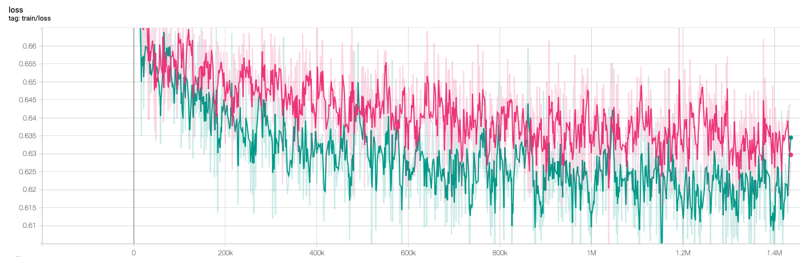

# ETM and Propensity Score Model

This folder contains python scripts for fitting the ETM model and the neural propensity score model. 

## Scripts
- `args.py` specifies the arguments used in training and testing.
- `data_utils.py` builds the CNNDM dataset.
- `get_lens.py` loops over the whole CNNDM training set to get the document lengths, which is saved to `save/document_lengths.json`.
- `get_ps.py` loops over the whole CNNDM training set to get the true propensity score dictionary, which is saved to `save/propensity_scores.json`.
- `models.py` sets up the propensity score model structure and the ETM model structure.
- `plot_lens.py` utilizes the document lengths generated by `get_lens.py` to plot the distribution of the lengths (saved to `save/doc_lens_hist.jpg`), so that we can have a better idea about the length threshold.
- `run_etm.py` uses data parallelism to train the ETM model.
- `run_ps.py` uses the weighted topic vector as the input to PSNet, which turns out to perform worse.
- `run_ps2.py` uses the topic proportion vector as the input to PSNet, which has better prediction accuracy on the trainining and the validation set, so this model is the final model.
- `test_ps2.py` applies the trained ETM model and the trained PSNet model to the training set to obtain the estimated propensity scores and generates the dataset (saved to `save/sim_data.py`) for simulation.
- `utils.py` includes the utility functions for training and testing.

## Training Details
The pink curves represent the PS model and the green curves represent PS2 model.

### Training Loss

### Validation Accuracy

### Validation Loss
